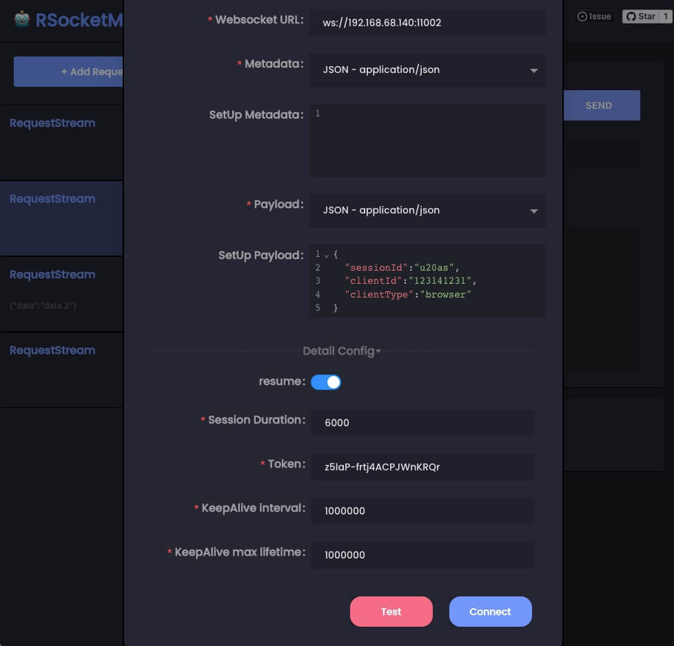

# rsocketMan 🐳

<p align="center">
<a href="https://github.com/HaiyaoTec/rsocketMan" target="_blank">

</a>
</p>

A devtool for rsocket protocol 🔧

Easy to help you to test your rsocket servers 🎸




# Development Environment 🎨

## Installation 🌟

In rsocketMan-server and in rsocketMan-client

```bash
  npm install
```

## Usage 🍉

- In rsocketMan-server run `ts-node index.ts`


- In rsocketMan-client run `npm run dev `


## Authors

- [@sudongyuer](https://github.com/sudongyuer)

  
